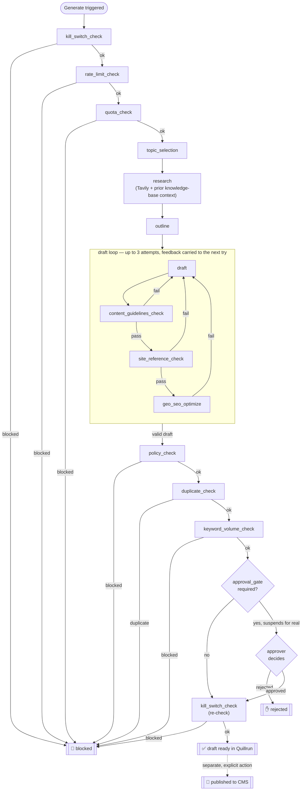

# Quillrun

Quillrun is a multi-tenant SaaS product: an autonomous SEO/GEO content agent that researches, writes, and auto-publishes blog content to a customer's own CMS (WordPress, Webflow, Shopify, or a hosted blog we provide), with almost no manual work.

**GEO** (Generative Engine Optimization) means optimizing content to be cited/surfaced by AI answer engines (ChatGPT, Perplexity, AI Overviews), not just ranked by classic search — it sits alongside traditional SEO as a quality gate in the generation pipeline.

| | |
|---|---|
| 🌐 Marketing site | [quillrun.dev](https://quillrun.dev) |
| 📊 Dashboard | [app.quillrun.dev](https://app.quillrun.dev) |
| 🔌 MCP endpoint | `quillrun-api.vercel.app/mcp` — 11 tools, see [below](#mcp-server) |

## Who it's for

Small business owners and marketing-ops people at agencies, managing content for one or several client sites. They're trusting an AI to write and publish under their brand with no review step by default. The product's central design problem is making that trust legible — what the agent is about to do, what it just did, why a piece of content passed or failed quality gates, and a clear, always-visible way to stop it.

## How a post gets made

Every "Generate" click — manual, scheduled, or via an MCP tool call — runs the same durable pipeline. Guardrails run first and cheap, before any AI cost is spent; the draft loop retries itself with real feedback on failure; three more hard blockers run after a valid draft exists; approval is an optional real pause, not a timeout.



A **succeeded** run only ever produces a `draft` post — going live on the tenant's CMS is always a separate, explicit "Publish now" action (or the `publish_post` MCP tool), never automatic.

## Architecture

A Turborepo monorepo (npm workspaces):

```
apps/
  app/    main tenant dashboard — sign-in, onboarding, sites, generate, runs, posts, schedule, guardrails, billing
  web/    marketing site + public tenant-blog rewrite (org-slug.quillrun.dev/blog/slug)
  api/    cron dispatcher, /internal/* (operator + customer-MCP-gateway API), /mcp (customer-facing MCP server), Stripe/webhook receivers

packages/
  ai-engine/         generation pipeline: topic_selection → research → outline → draft →
                      geo_seo_optimize → policy_check, on Vercel AI SDK + Gemini
  workflows/          Workflow DevKit orchestration wrapping ai-engine in durable "use step" functions
  cms-adapters/       CmsAdapter interface + registry: hosted-blog, WordPress, Webflow, Shopify
  search-console/     Google Search Console OAuth2 + Search Analytics client
  google-ads/         Google Ads Keyword Planner OAuth2 + volume lookups
  security/           shared OAuth state-signing helper, security headers
  database/           Supabase client (service-role) + generated types + SQL migrations
  auth/               @supabase/ssr wrapper (browser/server clients, useAuth hook)
  design-system/      shared UI components (shadcn-based), Quillrun brand tokens
  rate-limit/         Upstash-backed rate limiting
  payments/           Stripe billing
  analytics/          GA4 + Google Ads conversion tracking
  cms/                content model for legal pages
  ...and observability, feature-flags, notifications, storage, collaboration,
     internationalization, next-config, typescript-config
```

```mermaid
flowchart LR
    dashboard["apps/app\n(tenant dashboard)"] -->|start()| workflow["packages/workflows\ncontent-pipeline.ts"]
    cron["apps/api\ncron dispatcher"] -->|scheduled| workflow
    mcpClient["AI client\n(Claude, etc.)"] -->|MCP tool call| mcpServer["apps/api /mcp\n(per-tenant API key)"]
    mcpServer -->|"self-call, same guardrails"| internal["apps/api /internal/*"]
    internal --> workflow
    workflow --> aiengine["packages/ai-engine\nGemini + Tavily"]
    workflow --> db[("Supabase\nPostgres + pgvector")]
    workflow --> cms["packages/cms-adapters\n→ tenant's real CMS"]
    aiengine -.->|embeddings| db
```

## AI stack

| Role | Provider | Notes |
|---|---|---|
| Text generation | Google Gemini (`gemini-3.6-flash`) | Free-tier friendly; swapped off Anthropic early on |
| Web research | Tavily | Grounds fact-extraction in raw search content, not just the model's own prose |
| Embeddings (duplicate-check + research knowledge base) | Google Gemini (`gemini-embedding-001`) | Switched from OpenAI after its billing lapsed — see `packages/ai-engine/embedding.ts`. Self-hosted Ollama supported as a manual override; see the [WorkFlow-Automation](https://github.com/YukeshDhakal/WorkFlow-Automation) repo's `ollama-host/` if you ever need it |
| Orchestration | Vercel Workflow DevKit (`"use step"`, durable, suspend/resume) | Powers the approval-gate pause and crash-safe resume |

## Guardrails

Every run passes through the same gates regardless of trigger — manual, scheduled, or MCP:

| Gate | Blocks on | Best-effort or hard? |
|---|---|---|
| `kill_switch_check` (×2: before AI cost, and again right before publish) | Org/site paused, or the platform-wide emergency stop | Hard |
| `rate_limit_check` | Too many runs today for this tenant | Hard |
| `quota_check` | Monthly post quota reached | Hard |
| `content_guidelines_check` / `site_reference_check` | Draft fails brand/site-reference rules | Hard, retried with feedback |
| `policy_check` | Content policy violation | Hard |
| `duplicate_check` | Too similar to an existing post (cosine similarity on embeddings) | Best-effort — skips if no embedding provider configured, never silently "passes" |
| `keyword_volume_check` | Primary keyword has no real search volume | Best-effort — skips without a Keyword Planner cache |
| `approval_gate` | Tenant requires manual approval | Optional per-tenant setting; a real suspend/resume, not a timeout |

## MCP server

`apps/api/app/mcp/route.ts` is a customer-facing MCP server — any AI client (Claude, etc.) can connect with a Quillrun API key (Guardrails → API keys in the dashboard) and get 11 tools scoped to that key's organization only, with per-key monthly call caps and full audit attribution:

`list_sites` · `list_posts` · `get_recommendations` · `dismiss_recommendation` · `generate_content` · `get_run_status` · `publish_post` · `list_schedules` · `create_schedule` · `update_schedule` · `delete_schedule`

`organizationId` is never a tool argument — it's resolved server-side from the presented key, so no prompt injection or crafted tool call can move a call to another tenant.

## Stack

- **Framework**: Next.js (App Router), Turborepo, npm workspaces
- **Database & Auth**: Supabase (Postgres + pgvector + Supabase Auth)
- **AI**: Vercel AI SDK + Gemini + Tavily, orchestrated via Workflow DevKit
- **Payments**: Stripe
- **Rate limiting**: Upstash Redis (via Vercel Marketplace)
- **Deployment**: Vercel — three linked projects (`quillrun-app`, `quillrun-web`, `quillrun-api`), all tracking `master`

## Getting started

```bash
npm install
```

Each app needs its own environment variables — see `.env.example` in `apps/app`, `apps/web`, and `apps/api`, plus `packages/database`, `packages/cms`, and `packages/internationalization`. Most variables are optional by design (the app degrades gracefully when an integration isn't configured); only `NEXT_PUBLIC_APP_URL`/`NEXT_PUBLIC_WEB_URL` and the Supabase public config are required to build.

```bash
npm run dev      # run all apps in dev mode
npm run build    # build all apps
npm run test     # run all test suites
npm run check    # lint (ultracite/biome)
npm run fix      # lint --fix
```

Scoped to a single app or package:

```bash
npm run dev --workspace=apps/app
npm run test --workspace=@repo/google-ads
```

## Deployment

Each app deploys independently to its own Vercel project, all tracking the `master` branch:

| App | Vercel project | Domain |
|---|---|---|
| `apps/app` | `quillrun-app` | app.quillrun.dev |
| `apps/web` | `quillrun-web` | quillrun.dev |
| `apps/api` | `quillrun-api` | cron/webhooks/`/internal`/`/mcp` — no public dashboard |

```bash
vercel link --yes --project <project-name>   # from repo root
vercel deploy --prod --yes
```
